# Jira Service Management: Tier 1 Help Desk Ticketing and Workflow Lab

## Overview
This project shows the full lifecycle of a Tier 1 Help Desk ticket using Jira Service Management in a hybrid identity environment that includes:

- On-prem Active Directory (AD DS)
- Microsoft Entra ID (Cloud Sync)
- Microsoft 365
- Jira Service Management (Cloud)

The lab simulates a common MSP-style support request where a user cannot sign in due to a password expiration. The entire process is documented: intake, triage, troubleshooting, verification, communication, and closure.

---

## Skills Demonstrated
- Jira Service Management configuration and queue management  
- ITIL style ticket workflow (To Do, In Progress, Pending, Done)  
- Hybrid identity troubleshooting across AD DS, Entra ID, and Microsoft 365  
- Active Directory password reset procedures  
- Secure handling of credentials and internal notes  
- Clear, professional communication with end users  
- Use of Entra ID sign-in logs for verification  
- Documentation and audit trail management  

---

# Jira Skills Showcased
- Built a functional IT service desk project from scratch  
- Created organized request types and portal groups  
- Managed queues and ticket assignments  
- Used internal notes for technical work and public comments for end users  
- Followed structured workflow transitions to keep the ticket moving  
- Maintained a clear audit trail at every stage  

---

# Workflow Skills Demonstrated
- Used a clean workflow (To Do, In Progress, Pending, Done)  
- Added internal notes whenever work was performed  
- Used Pending only when waiting on the user  
- Verified the fix through AD and Entra ID before closing  
- Closed the ticket only after user confirmation and technical verification  

These reflect real help desk and MSP standards for ticket handling.

---

# Lab Walkthrough

## Phase 1: Jira Service Management Setup

### Step 1: Created the Jira Service Management project  
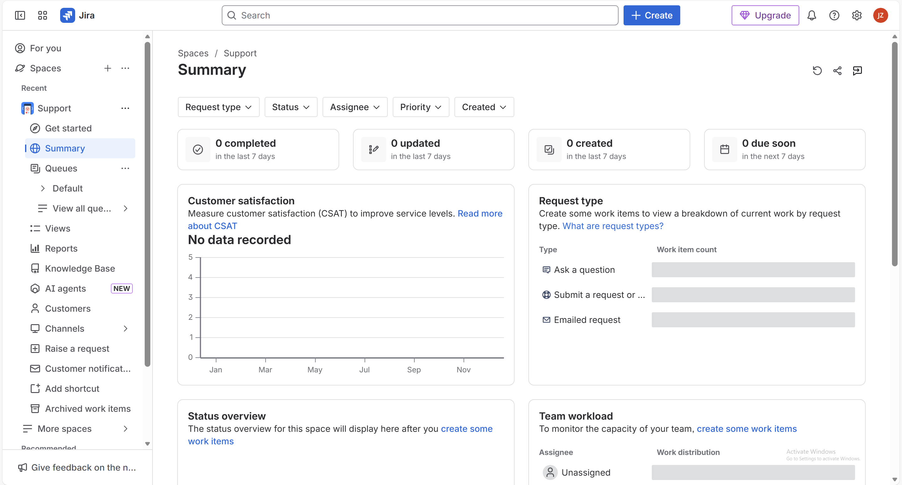

### Step 2: Set up service desk structure and queues  
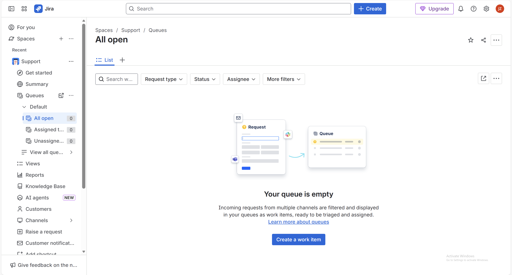

### Step 3: Created request types and portal groups  
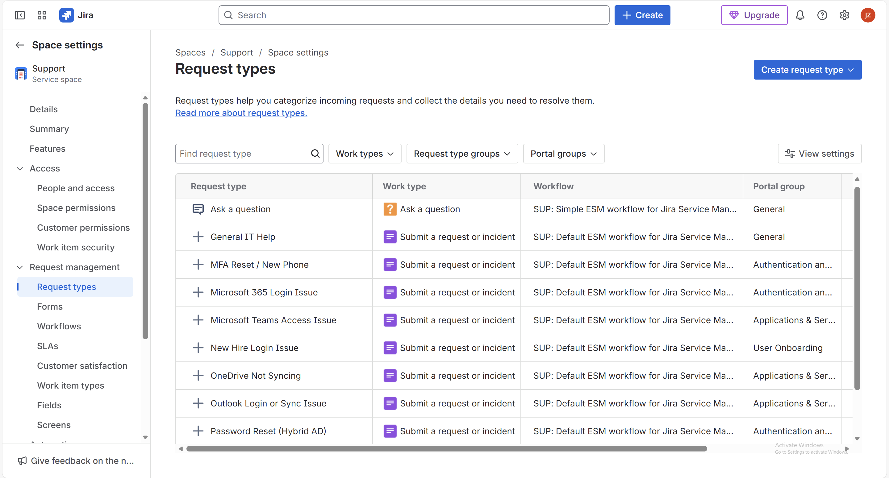  
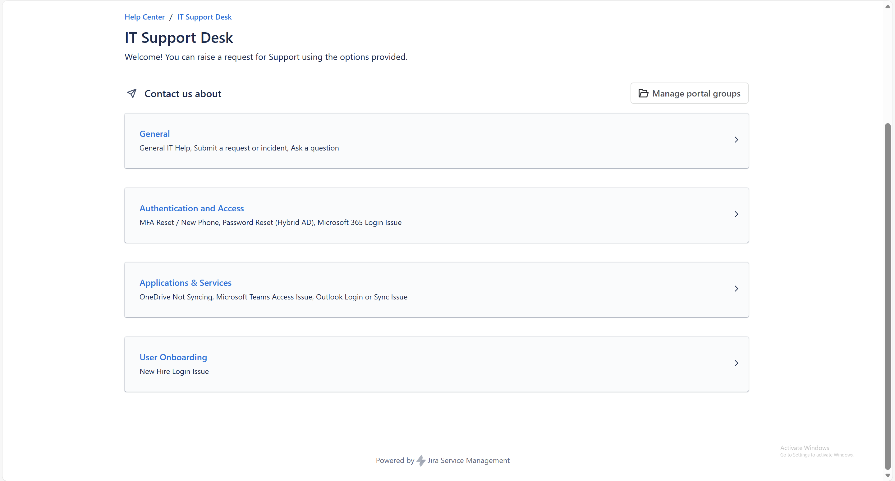

---

## Phase 2: Ticket Lifecycle and Workflow

### Step 4: Implemented ITIL style workflow  
Workflow used: Start, To Do, In Progress, Pending, Done

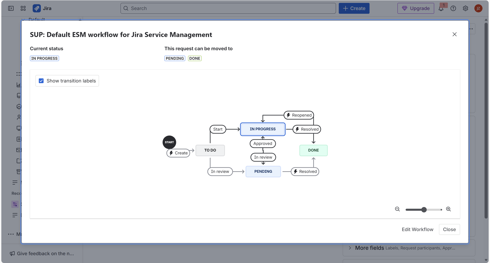

---

## Phase 3: Authentication Issue (Hybrid AD Password Reset)

### Step 5: User submits a password reset request  
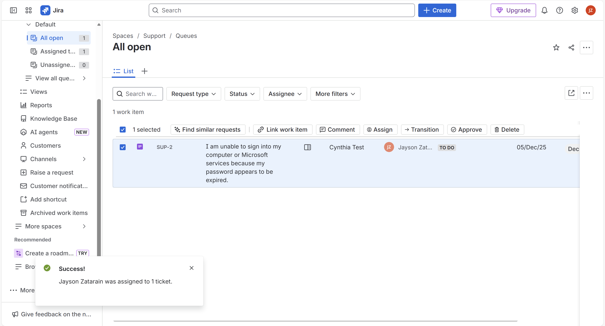

### Step 6: Ticket triaged and assigned  

### Step 7: Technician records the first internal note  
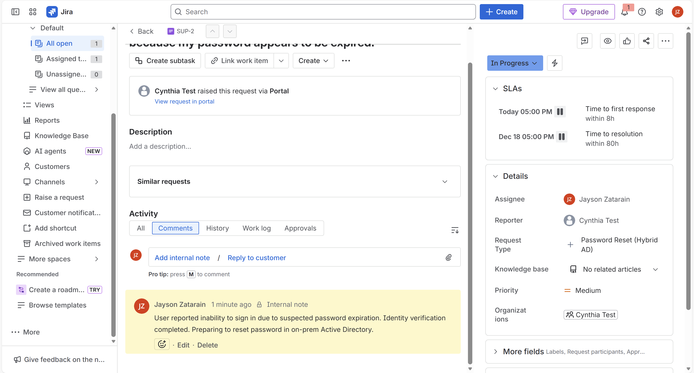

### Step 8: Password reset completed in on-prem Active Directory  
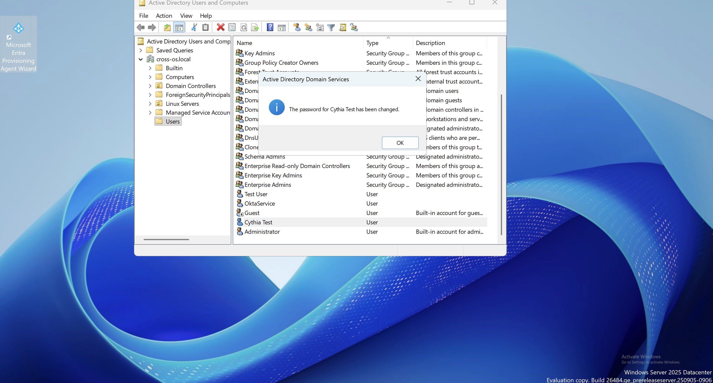

### Step 9: Internal documentation updated  
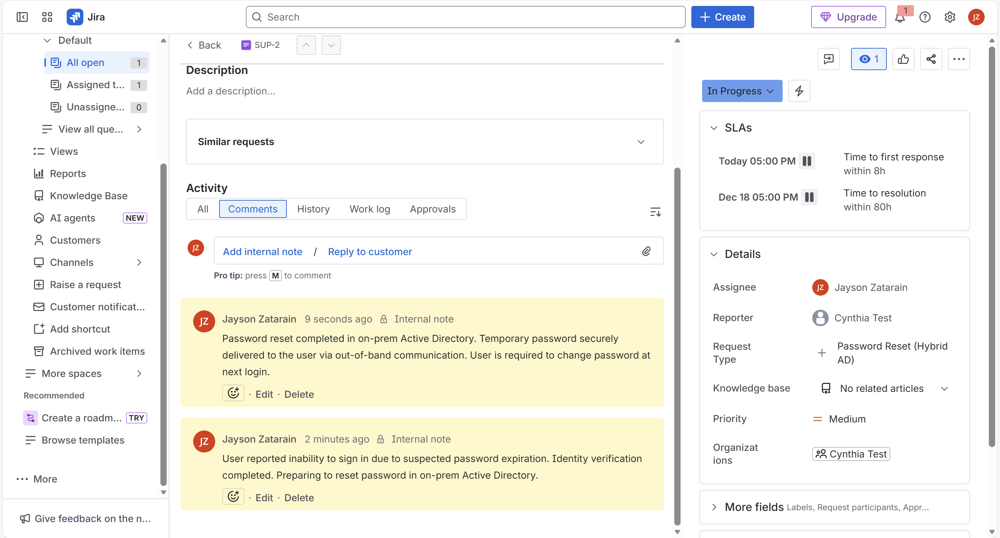

### Step 10: Ticket moved to Pending while waiting for user confirmation  
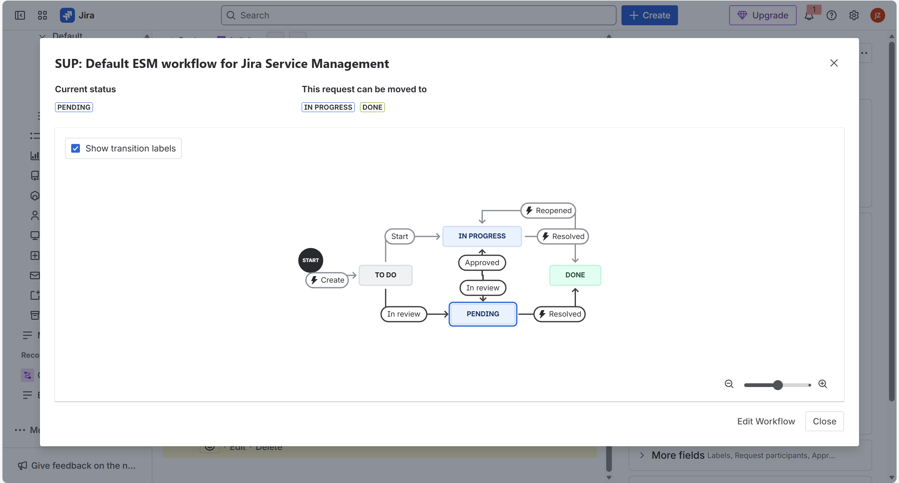

### Step 11: Public message sent to the user with next steps  
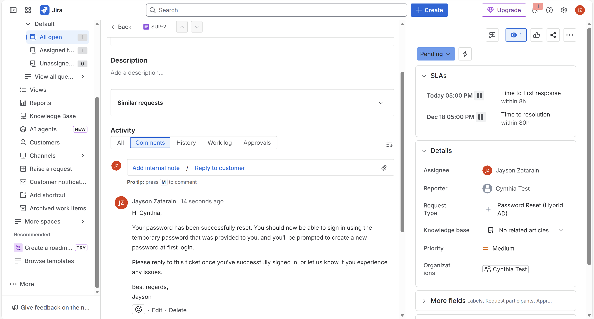

---

## Phase 4: Verification and Closure

### Step 12: Verified successful authentication in Entra ID  
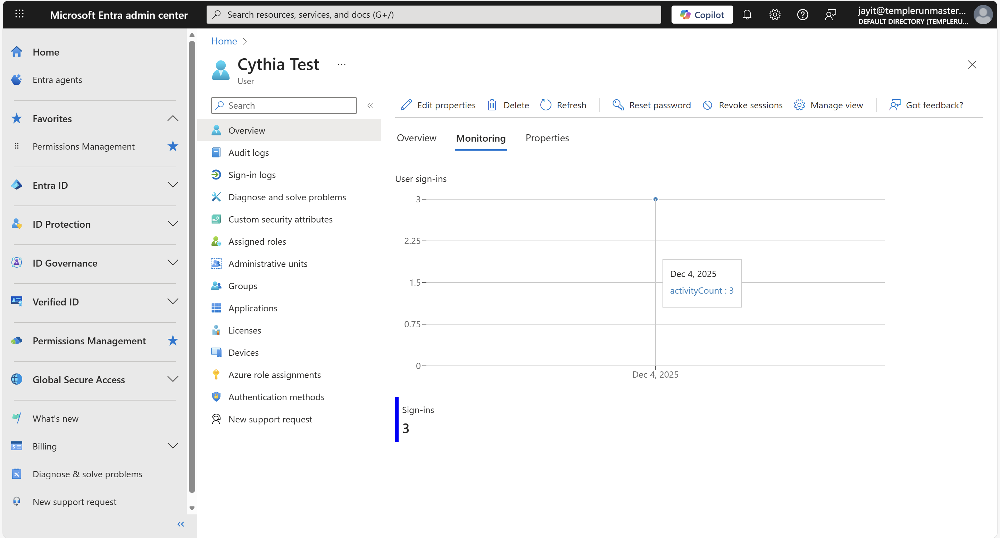

### Step 13: Internal note confirming that login was successful  
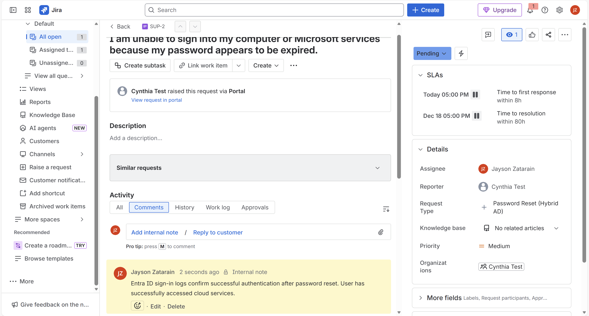

### Step 14: User confirms the issue is fully fixed  

### Step 15: Final public confirmation message sent  

### Step 16: Final internal note and closure summary added  
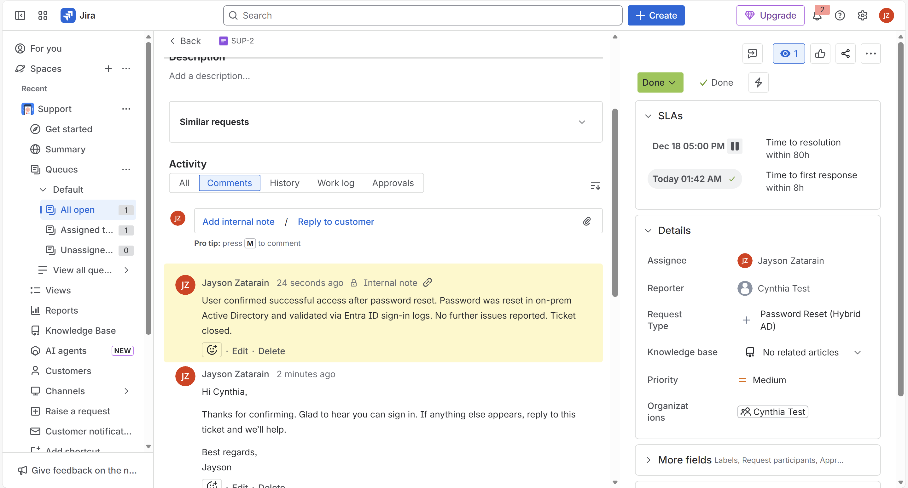

### Step 17: Ticket moved to Done  
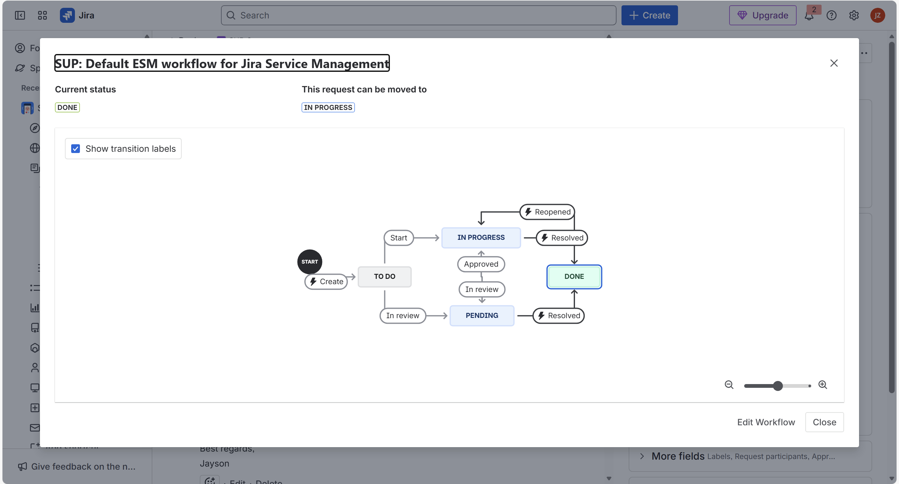

---

# Security Practices Followed
- No passwords or sensitive information included in ticket comments  
- Internal notes used for all technical details  
- Temporary credentials shared only through secure channels  
- AD DS and Entra ID logs used to verify resolution  
- Complete audit trail kept inside Jira  

---

# Final Outcome
- User regained access to Microsoft 365 services  
- Password reset and authentication verified across AD DS, Entra ID, and Microsoft 365  
- Ticket resolved using clear workflow steps  
- Professional communication maintained throughout  
- Demonstrates Tier 1 help desk and MSP support capability  

---

# Key Takeaways
This lab demonstrates practical skills in:

- Jira Service Management  
- Ticket lifecycle execution  
- Hybrid identity troubleshooting  
- Secure documentation and communication  
- MSP style service desk operations  

Relevant for roles such as:

- IT Support Technician  
- Help Desk Analyst  
- MSP Tier 1 or Tier 2 Support  
- Junior System Administrator  
- Cloud Support Associate  
